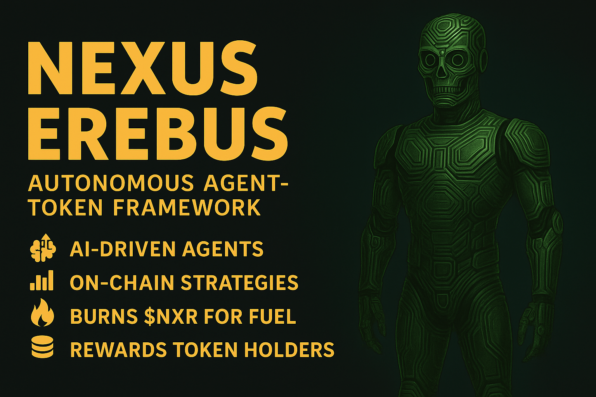
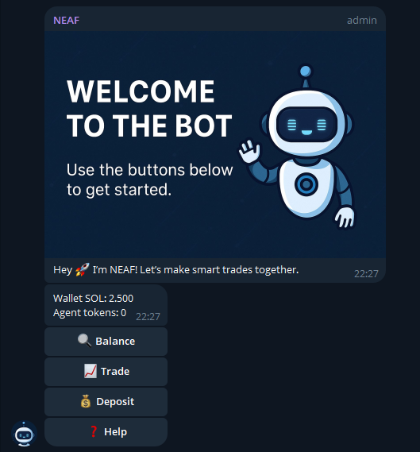
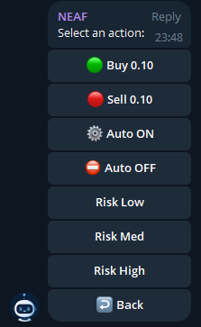

<p align="center">
  
</p>

<p align="center">
  <!-- GitHub stats -->
  <a href="https://github.com/MaliosDark/nexus-erebus-agent-token-framework/stargazers">
    
  </a>
  <a href="https://github.com/MaliosDark/nexus-erebus-agent-token-framework/network/members">
    
  </a>
  <a href="https://github.com/MaliosDark/nexus-erebus-agent-token-framework/issues">
    
  </a>
  <a href="https://github.com/MaliosDark/nexus-erebus-agent-token-framework/blob/main/LICENSE">
    
  </a>
  <a href="https://github.com/MaliosDark/nexus-erebus-agent-token-framework/commits/main">
    
  </a>
  <a href="https://komarev.com/ghpvc/?username=MaliosDark&repo=nexus-erebus-agent-token-framework">
    
  </a>

  <!-- Tech / ecosystem -->
<br/>


---

# Nexus Erebus 🚀  Autonomous Agent‑Token Framework

*Nexus Erebus* lets you spin up AI‑driven social agents, and beyond—each running real on‑chain strategies, burning $NXR for fuel, and rewarding holders of their micro‑tokens.


## ✨ Features

| Module                     | Highlights                                                                                          |
| -------------------------- | --------------------------------------------------------------------------------------------------- |
| **🧠 Agent Core**          | Ollama-driven persona with memory retrieval + goals from `.env`.                                    |
| **🔄 Auto-Wallet**         | One wallet per user; handles SOL → token swaps, fee-reserve, and NXR burns.                         |
| **📈 Jupiter v6 Swaps**    | Real main-net trades with retry & slippage guard.                                                   |
| **🔥 NXR Burn Loop**       | Every action swaps SOL → \$NXR → burn + dev-fee.                                                    |
| **🖼 Telegram UI**         | Banner greeting, inline menu, DM-only sensitive data.                                               |
| **🐤 Twitter Bridge**      | `@mention` commands + cookie/proxy session reuse.                                                   |
| **💾 Persistence (Redis)** | User wallets, balances, flags, risk profiles in Redis hashes; conversation memory in Redis Streams. |
| **🟢 Feature Flags**       | Enable/disable Telegram & Twitter at runtime via `USE_TELEGRAM`/`USE_TWITTER` env vars.             |
| **🎛️ Job Queues**         | BullMQ-powered queues for trades & LLM jobs, with retries, back-off and dead-letter handling.       |
| **⚡ Caching**              | Redis GET/SETEX for Jupiter quotes & token decimals, reducing API calls & latency.                  |
| **📊 Metrics**             | Prometheus endpoint (`/metrics`) via Express + `prom-client` for trades, burns, HP, queue stats.    |
| **🛡 Security**            | No external wallet reads; agent only trusts its own keys.                                           |
| **🧱 Bubble Firewall**     | Runtime shield with HP bar + Pub/Sub health events on `nexus.events`.                               |
| **✅ Environment Checker**  | Verifies required config, files & compiled deps on boot.                                            |

---

## 🏗 Folder Structure

```text
└── nexus-erebus-agent-token-framework/
    ├── README.md            📖 Project overview & docs
    ├── check-env.js         🔐 Pre-flight env & file validation
    ├── db.js                🗄️ Redis-backed user storage helpers
    ├── ensure-deps.js       🔧 Clone & build deps (Redis, Twitter client) + malloc fix
    ├── firewall.js          🛡️ Bubble firewall (HP shield + Pub/Sub health events)
    ├── index.js             🚀 Main runner (spawns Metrics & Worker, Telegram + Twitter)
    ├── jobQueue.js          🔄 BullMQ queue definitions for trades & LLM jobs
    ├── LICENSE              ⚖️ MIT license
    ├── memory.js            💾 Redis Streams for agent conversation memory
    ├── metrics.js           📈 Express + prom-client for `/metrics`
    ├── package.json         📦 NPM metadata, scripts & dependencies
    ├── redisClient.js       ❤️ Singleton ioredis client (with BullMQ config)
    ├── retry.js             🔁 Exponential backoff helper
    ├── telegram-client.js   💬 Telegram inline menus & message routing
    ├── twitter-client.js    🐦 Twitter scraper + DM support
    ├── utils-solana.js      🌊 Solana swaps, burns & balance listeners (with cache)
    ├── utils-token.js       🪙 Generic SPL-token utilities (decimals, transfers)
    ├── worker.js            ⚙️ BullMQ workers (process trades & LLM jobs)
    ├── .env.example         🌐 Sample environment configuration
    └── assets/              🖼️ Images & static assets
        ├── banner.png       🏷️ Hero banner
        ├── inline.png       📜 Inline menu screenshot
        └── welcome.png      👋 Welcome banner (DM)

```

---


## 🚦 Feature Flags

You can enable or disable each social channel at runtime without code changes, via two simple env vars in your `.env`:

```bash
# Enable/disable Telegram support
USE_TELEGRAM=true    # default: true

# Enable/disable Twitter support
USE_TWITTER=false    # default: false
```

* **`USE_TELEGRAM`** – when `false`, the TelegramClient won’t be initialized and no polling or button menus will be registered.
* **`USE_TWITTER`** – when `true`, the Twitter bridge spins up and listens for `@YourBot` mentions; otherwise all Twitter logic is skipped.
* This lets you run only the channels you need (or scale them independently in Docker/Kubernetes) without touching code.

---

## 🔧 Redis Integration

Replaced the old file-based DB and in-memory maps with Redis for:

1. **Cross-process state & persistence**

   * User wallets, balances, auto-trade flags, risk profiles stored in Redis Hashes (`HSET`/`HGET`).
   * A Redis Set tracks all active handles so workers can hydrate their own user maps on boot.

2. **Job queues & rate-limiting**

   * BullMQ queues for trades and LLM jobs (`bullmq` backed by Redis streams), ensuring you never hammer Jupiter, Ollama, or social APIs.
   * Automatic retry, back-off and dead-letter handling for failed jobs.

3. **Caching & performance**

   * Cache expensive calls (e.g. Jupiter quotes, token decimals) with `GET`/`SETEX` TTLs.
   * 10–100× fewer external API hits, lower latency.

4. **Pub/Sub & observability**

   * Firewall health updates and swap/transfer failures are published on a Redis channel (`nexus.events`), ready to hook into Grafana/Loki via Redis Pub/Sub.
   * Feel free to wire these events into your dashboard for real-time dashboards and alerts.

5. **Conversation memory**

   * Agent “memory” moved from flat JSON to per-user Redis Streams (`XADD`/`XREVRANGE`) with automatic TTL, so your LLM stays focused on recent context.

### Why Redis?

* **Atomic operations** (hashes, sets, streams) keep all nodes in sync.
* **Persistence** and **snapshotting** ensure you never lose user data on crashes.
* **High throughput** (100k–1M ops/sec) at sub-millisecond latency.
* **Built-in TTLs** let us expire old memory entries automatically.
* **Rich ecosystem** (BullMQ, Pub/Sub, Prometheus exporters) plugs right into modern observability stacks.

Add or configure your Redis instance in `.env`:

```bash
REDIS_URL=redis://localhost:6379
# REDIS_PASS=<your password, if needed>
```


## 🚀 Quick Start

```bash
git clone https://github.com/MaliosDark/nexus-erebus-agent-token-framework
cd nexus-erebus-agent-token-framework
cp .env.example .env       # fill in your agent keys + config
npm install                # install all dependencies
npm start                  # auto-checks .env + starts agent
```

> ✅ `npm start` uses `check-env.js` to verify:
> - `.env` + required fields
> - presence of `index.js`, `package.json`
> - readable config before booting any Solana agent

## 🐤 Twitter Command Cheatsheet  *(v 2.1)*

> Mention the bot in a tweet **or** reply to any of its tweets.  
> The bot only parses messages that include its handle (`@YourBot`).

| Purpose | Syntax (example) | Notes |
|---------|-----------------|-------|
| **Show deposit address** | `@YourBot deposit`<br/>`@YourBot wallet` | Returns the SOL address bound to your Twitter handle. |
| **Show balance** | `@YourBot balance` | SOL & agent‑token holdings. |
| **Buy a token** | `@YourBot buy 8HVy… 0.25` | `buy <MINT> <SOL>` |
| **Sell a token** | `@YourBot sell 8HVy… 0.25` | Reverse swap. |
| **Toggle auto‑trading** | `@YourBot auto on`<br/>`@YourBot auto off` | Per‑user switch. |
| **Set risk profile** | `@YourBot risk low` / `med` / `high` | Influences future auto‑trades. |

⚠️ Make sure you set **`AGENT_TW_HANDLE`** in your `.env` — *without* the
leading “@” — so the framework can strip self‑mentions before parsing.

---

## 📜 Environment Reference

| Variable | Description |
|----------|-------------|
| `AGENT_NAME`            | `AgentName`|
| `AGENT_MINT`            | SPL mint of the agent token |
| `TIER_THRESHOLDS`       | CSV of bronze,silver,gold levels |
| `RPC`                   | Solana RPC endpoint |
| `NXR_MINT`              | Core $NXR mint |
| `DEV_WALLET_SK`         | JSON array secret‑key (burn fee receiver) |
| `OLLAMA_URL`            | Local Ollama endpoint |
| `OLLAMA_MODEL`          | eg. `llama3.2:3b` |
| `TELEGRAM_BOT_TOKEN`    | BotFather token |
| `TWITTER_USERNAME`      | Twitter login (UI scraping) |
| `TWITTER_PASSWORD`      | Twitter login |
| `TWITTER_PROXY_URL`     | Optional proxy `http://user:pass@ip:port` |
| `TWITTER_COOKIES_PATH`  | Reuses session across boots |
| `AGENT_TW_HANDLE`       | Bot’s Twitter handle **without “@”** |
| `FW_MAX_HP`             | Starting firewall HP (default `20`) |
| `FW_DECAY_ON_ERROR`     | HP lost per logic error (default `2`) |
| `FW_DECAY_ON_RPC_FAIL`  | HP lost on RPC/network errors (default `5`) |
| `FW_AUTO_EXIT`          | Shut down on 0 HP (`true` / `false`) |

---

## 🖼️ Screenshots

| Welcome Banner (DM) | Inline Menu |
|---------------------|-------------|
|  |  |

---

## 🛡 Bubble Firewall Protection

Each agent runs inside a **protective runtime firewall**:
- 💥 Tracks every swap failure, RPC error, or exception
- 🔋 Visual HP bar in the console
- 🔐 Auto-shuts down when health reaches 0 to protect your keys
- 🧠 Configurable via `.env`: `FW_MAX_HP`, `FW_DECAY_ON_ERROR`, etc.

---

## 🤝 Contributing

1. **Fork** the repo  
2. `npm i` and run `npm run lint` before PR  

Stars ⭐ and feedback are always welcome!

---

<p align="center">
Made with 🖤 by Malios Dark & the Nexus Erebus core team · Powered by Solana, Ollama & Jupiter
</p>
