<p align="center">
  
</p>

<p align="center">
  <!-- GitHub stats -->
  <a href="https://github.com/MaliosDark/nexus-erebus-agent-token-framework/stargazers">
    
  </a>
  <a href="https://github.com/MaliosDark/nexus-erebus-agent-token-framework/network/members">
    
  </a>
  <a href="https://github.com/MaliosDark/nexus-erebus-agent-token-framework/issues">
    
  </a>
  <a href="https://github.com/MaliosDark/nexus-erebus-agent-token-framework/blob/main/LICENSE">
    
  </a>
  <a href="https://github.com/MaliosDark/nexus-erebus-agent-token-framework/commits/main">
    
  </a>
  <a href="https://komarev.com/ghpvc/?username=MaliosDark&repo=nexus-erebus-agent-token-framework">
    
  </a>

  <!-- Tech / ecosystem -->
<br/>


---

# Nexus Erebus 🚀  Autonomous Agent‑Token Framework

*Nexus Erebus* lets you spin up AI‑driven social agents, and beyond—each running real on‑chain strategies, burning $NXR for fuel, and rewarding holders of their micro‑tokens.

## ✨ Features

| Module                     | Highlights                                                                                          |
| -------------------------- | --------------------------------------------------------------------------------------------------- |
| **🧠 Agent Core**          | Ollama-driven persona with memory retrieval + goals from `.env`.                                    |
| **🔄 Auto-Wallet**         | One wallet per user; handles SOL → token swaps, fee‑reserve, and NXR burns.                         |
| **📈 Jupiter v6 Swaps**    | Real main‑net trades with retry & slippage guard.                                                   |
| **🔥 NXR Burn Loop**       | Every action swaps SOL → \$NXR → burn + dev‑fee.                                                    |
| **🖼 Telegram UI**         | Banner greeting, inline menu, DM‑only sensitive data.                                               |
| **🐤 Twitter Bridge**      | `@mention` commands + cookie/proxy session reuse.                                                   |
| **💾 Persistence (Redis)** | User wallets, balances, flags, risk profiles in Redis hashes; conversation memory in Redis Streams. |
| **🟢 Feature Flags**       | Enable/disable Telegram & Twitter at runtime via `USE_TELEGRAM`/`USE_TWITTER` env vars.             |
| **🎛️ Job Queues**         | BullMQ‑powered queues for trades & LLM jobs, with retries, back‑off and dead‑letter handling.       |
| **⚡ Caching**             | Redis GET/SETEX for Jupiter quotes & token decimals, reducing API calls & latency.                  |
| **📊 Metrics**             | Prometheus endpoint (`/metrics`) via Express + `prom-client` for trades, burns, HP, queue stats.    |
| **🛡 Security**            | No external wallet reads; agent only trusts its own keys.                                           |
| **🧱 Bubble Firewall**     | Runtime shield with HP bar + Pub/Sub health events on `nexus.events`.                               |
| **✅ Environment Checker** | Verifies required config, files & compiled deps on boot.                                            |

---

## 🏗 Folder Structure

```text
└── nexus-erebus-agent-token-framework/
    ├── README.md            📖 Project overview & docs
    ├── check-env.js         🔐 Pre-flight env & file validation
    ├── db.js                🗄️ Redis-backed user storage helpers
    ├── ensure-deps.js       🔧 Clone & build deps (Redis, Twitter client) + malloc fix
    ├── firewall.js          🛡️ Bubble firewall (HP shield + Pub/Sub health events)
    ├── index.js             🚀 Main runner (spawns Metrics & Worker, Telegram + Twitter)
    ├── jobQueue.js          🔄 BullMQ queue definitions for trades & LLM jobs
    ├── LICENSE              ⚖️ MIT license
    ├── memory.js            💾 Redis Streams for agent conversation memory
    ├── metrics.js           📈 Express + prom-client for `/metrics`
    ├── package.json         📦 NPM metadata, scripts & dependencies
    ├── redisClient.js       ❤️ Singleton ioredis client (with BullMQ config)
    ├── retry.js             🔁 Exponential backoff helper
    ├── telegram-client.js   💬 Telegram inline menus & message routing
    ├── twitter-client.js    🐦 Twitter scraper + DM support
    ├── utils-solana.js      🌊 Solana swaps, burns & balance listeners (with cache)
    ├── utils-token.js       🪙 Generic SPL‑token utilities (decimals, transfers)
    ├── worker.js            ⚙️ BullMQ workers (process trades & LLM jobs)
    ├── .env.example         🌐 Sample environment configuration
    └── assets/              🖼️ Images & static assets
        ├── banner.png       🏷️ Hero banner
        ├── inline.png       📜 Inline menu screenshot
        └── welcome.png      👋 Welcome banner (DM)
````

---

## 🖥 Prerequisites

| Tool / Service | Min Version | Notes                                                |
| -------------- | ----------- | ---------------------------------------------------- |
| **Node.js**    | ≥ 16        | tested on LTS 18–22                                  |
| **npm**        | ≥ 8         | pnpm/yarn OK                                         |
| **Redis**      | ≥ 6         | auto‑compiled by `ensure-deps.js`, or bring your own |
| **Ollama**     | ≥ 0.1.21    | local model download ≈ 4 GB                          |
| **Git & make** | —           | used to compile Redis                                |
| **Solana CLI** | any         | key generation & RPC helpers                         |

---


## 🏗 Architecture Overview 

```mermaid
flowchart LR
  %% ─── user side ───
  subgraph Users
    TG("Telegram\nUser")
    TW("Twitter\nUser")
    GFX(Grafana)
  end

  %% ─── core process ───
  subgraph Agent
    AGENT("Nexus Erebus\nAPI + Telegraf")
    QUEUE("BullMQ Queues")
    METRICS("/metrics\n(Prometheus)")
    FW("Bubble Firewall\nHP Monitor")
  end

  %% ─── workers ───
  subgraph Workers
    WORKER("Trade / LLM Worker")
  end

  %% ─── external services ───
  subgraph External
    RPC("Solana RPC")
    JUP("Jupiter API")
    LLM("Ollama LLM")
  end

  %% ─── flows ───
  TG -->|"CMD / buttons"| AGENT
  TW -->|"@mention"| AGENT
  AGENT -->|enqueue| QUEUE
  QUEUE -->|fetch job| WORKER
  WORKER -->|"swap + burn"| RPC
  WORKER -->|quote| JUP
  WORKER -->|"LLM reply"| LLM
  WORKER -->|status| FW
  FW -.-> METRICS
  METRICS -->|scrape| GFX
  AGENT -->|"DM reply"| TG
  AGENT -->|"tweet reply"| TW

  %% ─── styling ───
  classDef user     fill:#FEE2E2,stroke:#333,color:#000;
  classDef core     fill:#C7D2FE,stroke:#333,color:#000;
  classDef worker   fill:#BBF7D0,stroke:#333,color:#000;
  classDef external fill:#FDE68A,stroke:#333,color:#000;

  class TG,TW,GFX user
  class AGENT,QUEUE,METRICS,FW core
  class WORKER worker
  class RPC,JUP,LLM external

```



---

## 🚦 Feature Flags

You can enable or disable each social channel at runtime without code changes, via two simple env vars in your `.env`:

```bash
# Enable/disable Telegram support
USE_TELEGRAM=true    # default: true

# Enable/disable Twitter support
USE_TWITTER=false    # default: false
```

* **`USE_TELEGRAM`** – when `false`, the TelegramClient won’t be initialized and no polling or button menus will be registered.
* **`USE_TWITTER`** – when `true`, the Twitter bridge spins up and listens for `@YourBot` mentions; otherwise all Twitter logic is skipped.
* This lets you run only the channels you need (or scale them independently in Docker/Kubernetes) without touching code.

---

## 🔧 Redis Integration

Replaced the old file-based DB and in-memory maps with Redis for:

1. **Cross-process state & persistence**

   * User wallets, balances, auto-trade flags, risk profiles stored in Redis Hashes (`HSET`/`HGET`).
   * A Redis Set tracks all active handles so workers can hydrate their own user maps on boot.

2. **Job queues & rate-limiting**

   * BullMQ queues for trades and LLM jobs (`bullmq` backed by Redis streams), ensuring you never hammer Jupiter, Ollama, or social APIs.
   * Automatic retry, back-off and dead-letter handling for failed jobs.

3. **Caching & performance**

   * Cache expensive calls (e.g. Jupiter quotes, token decimals) with `GET`/`SETEX` TTLs.
   * 10–100× fewer external API hits, lower latency.

4. **Pub/Sub & observability**

   * Firewall health updates and swap/transfer failures are published on a Redis channel (`nexus.events`), ready to hook into Grafana/Loki via Redis Pub/Sub.
   * Feel free to wire these events into your dashboard for real-time dashboards and alerts.

5. **Conversation memory**

   * Agent “memory” moved from flat JSON to per-user Redis Streams (`XADD`/`XREVRANGE`) with automatic TTL, so your LLM stays focused on recent context.

### Why Redis?

* **Atomic operations** (hashes, sets, streams) keep all nodes in sync.
* **Persistence** and **snapshotting** ensure you never lose user data on crashes.
* **High throughput** (100k–1M ops/sec) at sub-millisecond latency.
* **Built-in TTLs** let us expire old memory entries automatically.
* **Rich ecosystem** (BullMQ, Pub/Sub, Prometheus exporters) plugs right into modern observability stacks.

Add or configure your Redis instance in `.env`:

```bash
REDIS_URL=redis://localhost:6379
# REDIS_PASS=<your password, if needed>
```

## 🐳 Docker Setup

> One command spins up **Redis 6**, **Ollama** (auto‑pulls `llama3.2:3b`) and the Nexus Erebus agent.

<details>
<summary>docker-compose.yml</summary>

```yaml
version: "3.9"

services:
  redis:
    image: redis:6-alpine
    restart: unless-stopped
    command: ["redis-server", "--save", "60", "1", "--loglevel", "warning"]
    volumes:
      - redis-data:/data
    healthcheck:
      test: ["CMD-SHELL", "redis-cli ping || exit 1"]
      interval: 10s
      timeout: 5s
      retries: 5

  ollama:
    image: ollama/ollama:latest
    restart: unless-stopped
    ports:
      - "11434:11434"
    environment:
      - OLLAMA_MODELS=/ollama-models
    volumes:
      - ollama-models:/ollama-models
    command: >
      bash -ec '
        ollama pull llama3.2:3b || true
        exec ollama serve
      '
    healthcheck:
      test: ["CMD", "curl", "-f", "http://localhost:11434/"]
      interval: 30s
      timeout: 5s
      retries: 5

  agent:
    build: .
    restart: unless-stopped
    depends_on:
      redis:
        condition: service_healthy
      ollama:
        condition: service_healthy
    env_file: .env            # reuse your existing env file
    volumes:
      - .:/app                # hot‑reload for local dev
      - agent-data:/app/data  # cookies.json, logs
    ports:
      - "9100:9100"           # Prometheus /metrics
    command: ["npm", "start"]

volumes:
  redis-data:
  ollama-models:
  agent-data:
````

</details>

<details>
<summary>Dockerfile (placed in repo root)</summary>

```dockerfile
FROM node:22-slim

RUN apt-get update \
 && apt-get install -y --no-install-recommends git build-essential make \
 && rm -rf /var/lib/apt/lists/*

WORKDIR /app
COPY . .

RUN npm ci --omit=dev
RUN node ensure-deps.js      # builds agent‑twitter-client

ENV NODE_ENV=production TZ=UTC
CMD ["npm", "start"]
```

</details>

### Quick start

```bash
# build and launch everything
docker compose up -d

# watch logs
docker compose logs -f agent
```


## 🚀 Quick Start

```bash
git clone https://github.com/MaliosDark/nexus-erebus-agent-token-framework
cd nexus-erebus-agent-token-framework
cp .env.example .env       # fill in your agent keys + config
npm install                # install all dependencies
npm start                  # auto-checks .env + starts agent
```

> ✅ `npm start` uses `check-env.js` to verify:
> - `.env` + required fields
> - presence of `index.js`, `package.json`
> - readable config before booting any Solana agent

## 🐤 Twitter Command Cheatsheet *(v 2.1)*

> Mention the bot in a tweet **or** reply to any of its tweets.
> The bot only parses messages that include its handle (`@YourBot`).

| Purpose                  | Syntax (example)                           | Notes                                                 |
| ------------------------ | ------------------------------------------ | ----------------------------------------------------- |
| **Show deposit address** | `@YourBot deposit`<br/>`@YourBot wallet`   | Returns the SOL address bound to your Twitter handle. |
| **Show balance**         | `@YourBot balance`                         | SOL & agent‑token holdings.                           |
| **Buy a token**          | `@YourBot buy 8HVy… 0.25`                  | `buy <MINT> <SOL>`                                    |
| **Sell a token**         | `@YourBot sell 8HVy… 0.25`                 | Reverse swap.                                         |
| **Toggle auto‑trading**  | `@YourBot auto on`<br/>`@YourBot auto off` | Per‑user switch.                                      |
| **Set risk profile**     | `@YourBot risk low` / `med` / `high`       | Influences future auto‑trades.                        |

⚠️ Make sure you set **`AGENT_TW_HANDLE`** in your `.env` — *without* the leading “@”.

---

## 💬 Telegram Command Cheatsheet

| Purpose              | Command                |       |         |
| -------------------- | ---------------------- | ----- | ------- |
| Show deposit address | `deposit` or `wallet`  |       |         |
| Show balance         | `balance`              |       |         |
| Buy                  | `/buy <MINT> <SOL>`    |       |         |
| Sell                 | `/sell <MINT> <SOL>`   |       |         |
| Toggle auto‑trading  | `auto on` / `auto off` |       |         |
| Set risk profile     | \`risk low             |  med  |  high\` |

---

## 📜 Environment Reference

| Variable                                                                                           | Description                 |
| -------------------------------------------------------------------------------------------------- | --------------------------- |
| `AGENT_NAME`                                                                                       | `AgentName`                 |
| `AGENT_MINT`                                                                                       | SPL mint of the agent token |
| `TIER_THRESHOLDS`                                                                                  | CSV of bronze,silver,gold   |
| `RPC`                                                                                              | Solana RPC endpoint         |
| `NXR_MINT`                                                                                         | Core \$NXR mint             |
| `DEV_WALLET_SK`                                                                                    | JSON array secret‑key       |
| `OLLAMA_URL`                                                                                       | Local Ollama endpoint       |
| `OLLAMA_MODEL`                                                                                     | e.g. `llama3.2:3b`          |
| `TELEGRAM_BOT_TOKEN`                                                                               | BotFather token             |
| `TWITTER_USERNAME`                                                                                 | Twitter login               |
| `TWITTER_PASSWORD`                                                                                 | Twitter login               |
| `TWITTER_PROXY_URL`                                                                                | Optional proxy              |
| `TWITTER_COOKIES_PATH`                                                                             | Re‑uses session             |
| `AGENT_TW_HANDLE`                                                                                  | Bot Twitter handle          |
| `FW_MAX_HP`                                                                                        | Starting firewall HP        |
| `FW_DECAY_ON_ERROR`                                                                                | HP lost per logic error     |
| `FW_DECAY_ON_RPC_FAIL`                                                                             | HP lost on RPC fail         |
| `FW_AUTO_EXIT`                                                                                     | Auto‑exit at 0 HP           |
| `USDC_MINT`                                                                                        | USDC mint for quotes        |
| `MIN_NXR_SOL`                                                                                      | SOL converted to NXR fuel   |
| `MIN_SOL_FEES`                                                                                     | SOL kept for fees           |
| `NXR_BURN_PCT`                                                                                     | % of NXR burned             |
| `AUTO_TRADE_ENABLED`                                                                               | Enable auto‑trading         |
| `AUTO_TRADE_PERIOD_SEC`                                                                            | Auto‑trade interval         |
| `AI_RISK_PROFILE`                                                                                  | Default risk profile        |
| `AI_MAX_BUY_SOL`                                                                                   | SOL cap per buy             |
| `AI_TP_PERCENT`                                                                                    | Take‑profit %               |
| `AI_SL_PERCENT`                                                                                    | Stop‑loss %                 |
| `FW_WEIGHT_ERROR`, `FW_WEIGHT_RPCFAIL`, `FW_WEIGHT_SPAM`, `FW_WEIGHT_CRITICAL`                     | Firewall weights            |
| `FW_HEAL_RATE`, `FW_HEAL_INTERVAL`, `FW_BAR_LENGTH`                                                | Firewall heal settings      |
| `REDIS_PASS`                                                                                       | Redis password              |
| `AGENT_GREETING`, `AGENT_GREETING_IMG`                                                             | Welcome copy/banner         |
| `AGENT_MENU_TITLE`, `AGENT_MENU_BUTTONS`                                                           | Inline menu text            |
| `AGENT_PERSONA`, `AGENT_GOALS`                                                                     | LLM prompt seeds            |
| `AGENT_MEMORY_FILE`                                                                                | Memory file name            |
| `TWITTER_EMAIL`                                                                                    | Email for 2FA               |
| `TWITTER_API_KEY`, `TWITTER_API_SECRET_KEY`, `TWITTER_ACCESS_TOKEN`, `TWITTER_ACCESS_TOKEN_SECRET` | Twitter v2 creds            |

---

## 📊 Metrics & Observability

* **Endpoint** – [`/metrics`](http://localhost:9100/metrics) (Prometheus format).
* **Prometheus scrape example**

  ```yaml
  - job_name: 'nexus-erebus'
    static_configs:
      - targets: ['localhost:9100']
  ```
* **Grafana** – import `extras/grafana-dashboard.json` for live trades, burns, queue depth and firewall HP.

---

## 🖼️ Screenshots

| Welcome Banner (DM)                         | Inline Menu                                |
| ------------------------------------------- | ------------------------------------------ |
|  |  |

---

## 🔒 Security Notes

* **Firewall auto‑exit** – process exits at 0 HP (`FW_AUTO_EXIT=true`).
* **Self‑custody** – agent acts only with its own keypair (no external wallet reads).


---

## 🛡 Bubble Firewall Protection

Each agent runs inside a **protective runtime firewall**:

* 💥 Tracks every swap failure, RPC error, or exception
* 🔋 Visual HP bar in the console
* 🔐 Auto-shuts down when health reaches 0 to protect your keys
* 🧠 Configurable via `.env`: `FW_MAX_HP`, `FW_DECAY_ON_ERROR`, etc.

---

## 🛠 Troubleshooting / FAQ

| Symptom                    | Fix                                                            |
| -------------------------- | -------------------------------------------------------------- |
| `redis connection refused` | Make sure Redis is running (or `ensure-deps.js` completed).    |
| Ollama 404 / model missing | Check `OLLAMA_MODEL`; run `ollama pull <model>`.               |
| Twitter login loop         | Delete `cookies.json`, verify proxy / 2FA settings.            |
| Trades stuck in queue      | Ensure `worker.js` is up and RPC not rate‑limited.             |
| `Error: Firewall popped`   | Inspect recent errors, increase `FW_MAX_HP` or fix root cause. |

---

## 🛣 Roadmap

* [ ] Docker images for ARM + x64
* [ ] Serum/Jupiter v7 multi‑hop routes
* [ ] Jest unit tests + CI badge
* [ ] Governance mini‑DAO per agent‑token
* [ ] Web dashboard (Next.js + tRPC)

---


## 🤝 Contributing

1. **Fork** the repo
2. `npm i` and run `npm run lint` before PR

Stars ⭐ and feedback are always welcome!

---

<p align="center">
Made with 🖤 by Malios Dark & the Nexus Erebus core team · Powered by Solana, Ollama & Jupiter
</p>