# 🔐 Security Policy – Nexus Erebus Agent Framework

The **Nexus Erebus Agent Framework** is designed under strict security principles: *zero trust, minimal surface area, cryptographic integrity, and full observability*. It implements a **multi-layered paranoia stack**.

---

## 🧱 Layered Defense Architecture

Every request and event is subject to middleware filters, cryptographic validation, schema enforcement, and firewall monitoring.

```mermaid
flowchart TD
  %% ─── Client Interfaces ───
  UI[React UI]:::client
  TG[Telegram User]:::social
  TW[Twitter User]:::social

  %% ─── API & Protected Routes ───
  AuthEndpoint["API Auth Endpoint"]:::api
  Routes["Protected API Routes"]:::api
  WalletService["Wallet Service"]:::logic
  TradeHandler["Trade Queue Handler"]:::logic

  %% ─── Social Bot Gateway ───
  BotCore["Nexus Agent Core"]:::agent

  %% ─── Security & Validation ───
  ZodValidation["Zod Schema Validation"]:::security
  RateLimiter["Rate Limiter (Redis)"]:::security
  CSRFCheck["CSRF Protection (Double Submit)"]:::security
  JWTCheck["JWT Verification w/ HKDF"]:::security

  %% ─── Monitoring & Infrastructure ───
  FW["Bubble Firewall (Health Monitor)"]:::firewall
  Metrics["/metrics"]:::infra
  Redis[(Redis)]:::infra

  %% ─── Auth Flow ───
  UI -->|POST /auth| AuthEndpoint
  AuthEndpoint -->|JWT + CSRF Cookie| UI
  UI -->|Bearer JWT + CSRF Header| Routes

  %% ─── API Operations ───
  Routes -->|GET /wallet| WalletService
  Routes -->|POST /trade| TradeHandler

  %% ─── Bot Interactions ───
  TG -->|Button Callback| BotCore
  TW -->|Mention| BotCore
  BotCore -->|Trigger Trade| TradeHandler
  BotCore -->|DM Reply| TG
  BotCore -->|Tweet Reply| TW

  %% ─── Security Checks ───
  AuthEndpoint -.-> ZodValidation
  AuthEndpoint -.-> RateLimiter
  Routes -.-> CSRFCheck
  Routes -.-> JWTCheck

  %% ─── Monitoring ───
  TradeHandler --> FW
  FW -->|Metrics| Metrics

  %% ─── Redis Connections ───
  WalletService --> Redis
  TradeHandler --> Redis
  RateLimiter --> Redis
  CSRFCheck --> Redis
  JWTCheck --> Redis

  %% ─── Styling ───
  classDef client     fill:#E0F2FE,stroke:#1E40AF,color:#000;
  classDef api        fill:#DBEAFE,stroke:#1E3A8A,color:#000;
  classDef logic      fill:#EDE9FE,stroke:#6B21A8,color:#000;
  classDef security   fill:#FCE7F3,stroke:#831843,color:#000,font-style:italic;
  classDef infra      fill:#FDE68A,stroke:#92400E,color:#000;
  classDef agent      fill:#C7D2FE,stroke:#1D4ED8,color:#000;
  classDef social     fill:#FBCFE8,stroke:#9D174D,color:#000;
  classDef firewall   fill:#FCA5A5,stroke:#991B1B,color:#000,font-weight:bold;

```



---

## 📋 Core Security Features

### API Server (`api-server.js`)

* ✅ **Daily-Rotating JWTs** (HMAC-SHA256 via HKDF)
* 🛡 **CSRF Protection**: Double submit cookie/header
* 🔍 **Zod Schema Validation** for all POST payloads
* 🧱 **Redis Rate Limiting**: 200 reqs / 15 min / IP
* 🧼 **Input Sanitization**:

  * `helmet`, `hpp`, `xss-clean`, `express-mongo-sanitize`
* 🛰 **ULID Tracing** for all request logs
* 🔒 **CORS Whitelisting** via `.env`
* 🚫 **No Private Keys** exposed outside the agent process

---

## 🛰 Telegram + Twitter Gateway Security

### Telegram

* Handles only structured callback queries, never raw text
* Verifies user via handle → mapped in Redis
* Logs all actions with ULID + TTL for replay protection

### Twitter

* Processes mentions from a verified list
* Replies/DMs are idempotent and write-protected
* Full handle-to-agent verification pipeline enforced

---

## 🧯 Bubble Firewall

The `firewall.js` module monitors real-time agent behavior and publishes alerts to `/metrics`.

* 🩺 LLM response time tracking
* 📉 Trade execution failure detection
* 🔔 Prometheus-compatible events
* 💣 Optional auto-disable triggers (future)

---

## 🔄 Token Lifecycle

* JWT signed with `HMAC-SHA256` + daily `HKDF`
* 2h expiration
* Requires:

  * `Authorization: Bearer <token>`
  * `x-csrf-token` header
  * `csrf_tok` cookie

```env
API_JWT_SECRET=change_this_to_a_long_random_string
CORS_ORIGIN=https://frontend.yourdomain.app
CSRF_COOKIE=csrf_tok
```

---

## ✅ Authentication Flow

1. Client sends a `POST /auth` request with a Telegram or Twitter handle
2. Server issues:

   * JWT signed with daily HKDF-derived key
   * `csrf_tok` cookie
3. Frontend stores token and echoes it in all requests
4. On protected routes, server:

   * Verifies JWT integrity and expiry
   * Confirms CSRF header/cookie match

Frontend must validate ownership before calling `/auth`
(e.g. DM or tweet challenge verification via bot logic)

---

## 📦 Agent Hardening

* 🔐 Private keys live only in memory and never leave `index.js`
* 🧬 Trade operations routed through Redis queues
* 🤖 Agent and workers isolated via Docker Compose network
* 📈 Prometheus support via `metrics.js`

---

## 📣 Disclosure

Please report vulnerabilities responsibly to:

📧 **[malios666@gmail.com](mailto:malios666@gmail.com)**

---

## 👤 Maintainer

**MaliosDark**
GitHub → [https://github.com/MaliosDark](https://github.com/MaliosDark)

---
