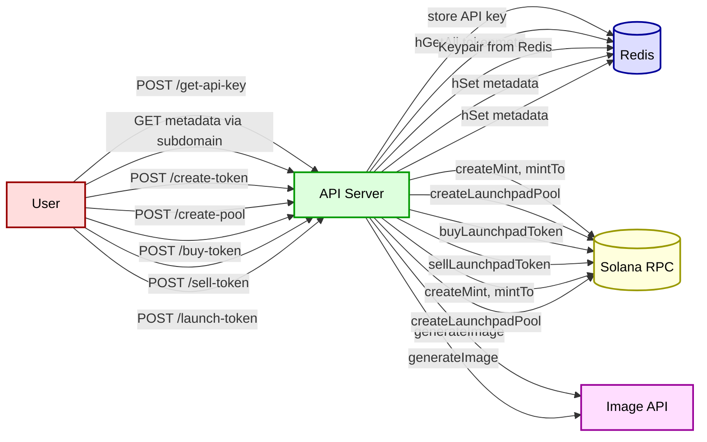
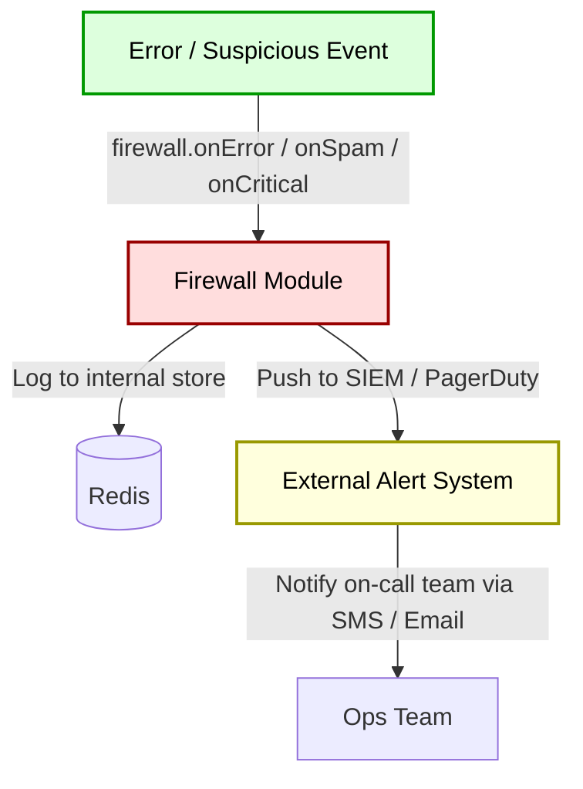

<!-- Badges -->


[]()
[]()


# Launcher API README

## Overview

The **Launcher API** is an Express-based microservice that handles:

* **API key generation & validation**
* **Subdomain metadata** endpoint (for token discovery)
* **SPL token creation** with auto-generated logo and metadata
* **Raydium Launchpad pool management** (create, buy, sell)
* **Full end-to-end launch** (token + pool)

The service is secured by per-user API keys (rotating every 2h), integrates with Redis for storage, Solana for on-chain actions, and an external image generation API for token logos. It also includes reCAPTCHA protection, CORS configuration, and a firewall module for monitoring and alerting on critical failures.

---

## Table of Contents

1. [Badges](#badges)
2. [Overview](#overview)
3. [Environment Variables](#environment-variables)
4. [Setup & Run](#setup--run)
5. [API Endpoints](#api-endpoints)
6. [Architecture Flows](#architecture-flows)

   1. [Main Flow](#main-flow)
   2. [Siren Alert Flow](#siren-alert-flow)
7. [Detailed Flow Description](#detailed-flow-description)
8. [Error Handling & Logging](#error-handling--logging)
9. [Security Considerations](#security-considerations)
10. [Monitoring & Alerts](#monitoring--alerts)
11. [Contact](#contact)

---

## Environment Variables

| Variable                | Description                                                             | Required / Default                            |
| ----------------------- | ----------------------------------------------------------------------- | --------------------------------------------- |
| `RPC_URL`               | Solana RPC endpoint (e.g. `https://api.mainnet-beta.solana.com`)        | **Required**                                  |
| `REDIS_URL`             | Redis connection string (e.g. `redis://localhost:6379`)                 | **Required**                                  |
| `PLATFORM_PRIVATE_KEY`  | Base58 or JSON-array secret key for the platform’s Solana account       | **Required**                                  |
| `DEV_LAUNCHPAD_PROGRAM` | Raydium Launchpad program ID                                            | **Required**                                  |
| `IMAGE_API_ROOT`        | Base URL for image generation API (text-to-image)                       | **Required**                                  |
| `METADATA_BASE_URL`     | Base URL for on-chain token metadata website                            | Optional, defaults to `https://myplatform.io` |
| `RECAPTCHA_SECRET`      | Google reCAPTCHA v3 secret key; enables CAPTCHA middleware              | Optional, CAPTCHA disabled if unset           |
| `BONDING_CURVE`         | One of `LINEAR` / `EXPONENTIAL` / `LOGARITHMIC`; defaults to `LINEAR`   | Optional                                      |
| `CORS_ORIGIN`           | Allowed CORS origin (e.g. `https://app.myplatform.io`); defaults to `*` | Optional                                      |
| `PORT`                  | HTTP port for the server                                                | Optional, defaults to `3989`                  |

---

## Setup & Run

1. **Install dependencies**

   ```bash
   npm install
   ```

2. **Configure `.env`** (see [Environment Variables](#environment-variables))

3. **Start the server**

   ```bash
   node /launcher/server.js
   ```

---

## API Endpoints

All **protected** endpoints require two HTTP headers:

* `x-user-id`: the user identifier (string)
* `x-api-key`: the per-user API key (expires in 2h)

### Public

| Method | Path                     | Description                                    |
| ------ | ------------------------ | ---------------------------------------------- |
| `POST` | `/get-api-key`           | Returns a fresh API key for the given `userId` |
| `GET`  | `/:mint` (via subdomain) | Returns cached metadata for token `<mint>`     |

### Protected

| Method | Path            | Description                                       |
| ------ | --------------- | ------------------------------------------------- |
| `POST` | `/create-token` | Mint an SPL token; auto-generate image + metadata |
| `POST` | `/create-pool`  | Create a Raydium Launchpad pool                   |
| `POST` | `/buy-token`    | Buy tokens from a launchpad pool                  |
| `POST` | `/sell-token`   | Sell tokens back to a pool                        |
| `POST` | `/launch-token` | Create SPL token + metadata + launchpad pool      |

---

## Architecture Flows

### Main Flow



#### Legend

* **User**: External client (frontend, curl)
* **API Server**: Express service in `/launcher/server.js`
* **Redis**: `apikey:*`, `wallet:*`, `tokenmeta:*`
* **Solana RPC**: On-chain transaction execution
* **Image API**: Third-party text-to-image for logos

---

### Alert Flow

This flow illustrates how critical errors and security events trigger the internal `firewall` module and escalate to an external alerting system.



---

## Detailed Flow Description

1. **API Key Generation** (`POST /get-api-key`)

   * Client submits `{ userId }` and a valid reCAPTCHA token in `x-captcha-token`.
   * Server verifies CAPTCHA (`verifyRecaptcha`) and throttles on failures.
   * Generates a 32-byte hex key, stores under `apikey:<userId>` with 2h TTL.
   * Returns `{ userId, apiKey, expiresIn: 7200 }`.

2. **Authentication Middleware**

   * Verifies `x-user-id` + `x-api-key` against Redis.
   * Blocks with 403 if invalid or missing.

3. **reCAPTCHA Protection**

   * Every protected route runs `captchaMiddleware`.
   * Tracks failure count per IP in Redis (`captcha:fail:<ip>`) and raises challenge requirements.
   * Resets on success; blocks or increases challenges on repeat failures.

4. **Subdomain Metadata**

   * Hostname pattern `<mint>.tokens.myplatform.io` triggers immediate metadata lookup.
   * Returns JSON from `tokenmeta:<mint>`.

5. **Create Token** (`POST /create-token`)

   * Inputs: `decimals`, `supply`, `tokenName`.
   * Retrieves `Keypair` from `wallet:<userId>`.
   * Mints SPL token, creates ATA, and mints initial supply.
   * Generates logo via external API (`generateImage`).
   * Stores metadata in Redis and returns mint details.

6. **Create Pool** (`POST /create-pool`)

   * Inputs: pool parameters including `curveType`, timings, and scales.
   * Constructs `PlatformConfig` and calls Raydium SDK.
   * Signs, sends transaction, returns signature.

7. **Buy / Sell Token** (`POST /buy-token`, `/sell-token`)

   * Fetches user ATA, constructs and sends Raydium SDK transactions.
   * Returns on-chain signature.

8. **Full Launch** (`POST /launch-token`)

   * Combines token minting + pool creation in one atomic endpoint.

---

## Error Handling & Logging

* All routes catch exceptions and respond with `500 { error: message }`.
* `firewall` module classifies events as **spam**, **error**, or **critical**.
* Critical failures (`onCritical`) trigger process exit or external alerts.
* All Redis/RPC failures are logged and optionally notified.

---

## Security Considerations

* **API Keys**: rotate every 2h, stored in Redis with TTL.
* **reCAPTCHA**: adaptive challenge based on failure count.
* **CORS**: configurable allowed origins (`CORS_ORIGIN`).
* **Firewall**: centralized handling of suspicious or critical events.
* **No plaintext keys**: platform key loaded only from environment.

---
