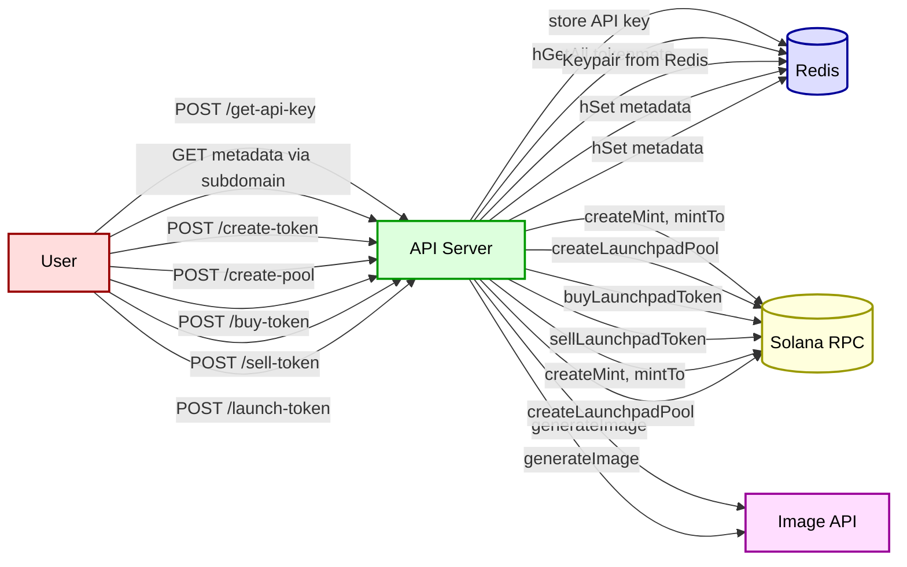

# Launcher API README

## Overview

The **Launcher API** is an Express-based microservice that handles:

* **API key generation & validation**
* **Subdomain metadata** endpoint (for token discovery)
* **SPL token creation** with auto-generated logo and metadata
* **Raydium Launchpad pool management** (create, buy, sell)
* **Full end-to-end launch** (token + pool)

The service is secured by per-user API keys (rotating every 2h) and integrates with Redis for storage, Solana for on-chain actions, and an external image generation API for token logos.

---

## Environment Variables

| Variable                | Description                                                      |
| ----------------------- | ---------------------------------------------------------------- |
| `RPC_URL`               | Solana RPC endpoint (e.g. `https://api.mainnet-beta.solana.com`) |
| `REDIS_URL`             | Redis connection string (e.g. `redis://localhost:6379`)          |
| `PLATFORM_PRIVATE_KEY`  | Base58 secret key for the platform's Solana account              |
| `DEV_LAUNCHPAD_PROGRAM` | Raydium Launchpad program ID                                     |
| `BONDING_CURVE`         | One of `LINEAR` / `EXPONENTIAL` / `LOGARITHMIC`                  |
| `IMAGE_API_ROOT`        | Base URL for image gen API (text-to-image)                       |
| `PORT`                  | HTTP port for the server (default `3989`)                        |

---

## Setup & Run

1. **Install dependencies**

   ```bash
   npm install
   ```
2. **Configure `.env`** (see above variables)
3. **Start the server**

   ```bash
   node /launcher/server.js
   ```

---

## API Endpoints

All protected endpoints require two HTTP headers:

* `x-user-id`: the user identifier (string)
* `x-api-key`: the per-user API key (expires in 2h)

### Public

| Method | Path           | Description                                |
| ------ | -------------- | ------------------------------------------ |
| `POST` | `/get-api-key` | Returns a fresh API key for the given user |

### Subdomain Metadata

If a request comes in to `<MINT>.tokens.myplatform.io`, the server will look up `tokenmeta:<MINT>` in Redis and return:

```json
{
  "name": "MyToken",
  "image": "https://.../images/<file>.png",
  "website": "https://myplatform.io/token/<MINT>"
}
```

### Protected

| Method | Path            | Description                                       |
| ------ | --------------- | ------------------------------------------------- |
| `POST` | `/create-token` | Mint an SPL token; auto-generate image + metadata |
| `POST` | `/create-pool`  | Create a Raydium Launchpad pool                   |
| `POST` | `/buy-token`    | Buy tokens from a launchpad pool                  |
| `POST` | `/sell-token`   | Sell tokens back to a pool                        |
| `POST` | `/launch-token` | Create SPL token + metadata + launchpad pool      |

---

## Architecture Flow



**Legend:**

* **User**: External client (frontend, curl)
* **API Server**: Express service in `/launcher/server.js`
* **Redis**: `apikey:*`, `wallet:*`, `tokenmeta:*`
* **Solana RPC**: On-chain transaction execution
* **Image API**: Third‑party text‑to‑image for logos

---

## Detailed Flow Description

1. **API Key Generation** (`POST /get-api-key`)

   * Client submits `userId`.
   * Server generates a random 32‑byte hex key, stores under `apikey:<userId>` with 2h TTL.
   * Returns `{ userId, apiKey, expiresIn: 7200 }`.

2. **Authentication Middleware**

   * All protected routes verify `x-user-id` + `x-api-key` against Redis.
   * Rejects with 403 if invalid or missing.

3. **Subdomain Metadata**

   * On every request, server inspects hostname: if `<mint>.<...>` where `mint` matches base58 length,
     loads token metadata from Redis and returns immediately.

4. **Create Token** (`POST /create-token`)

   * Extracts `decimals`, `supply`, `tokenName`.
   * Retrieves user's Solana `Keypair` from `wallet:<userId>` in Redis.
   * Calls `createMint`, `getOrCreateAssociatedTokenAccount`, `mintTo`.
   * Requests a logo from the Image API (`prompt = "Logo for token <name>"`).
   * Stores metadata `{name,image,website}` in `tokenmeta:<mint>`.
   * Responds with mint address, token account, logo URL, and website URL.

5. **Create Pool** (`POST /create-pool`)

   * Validates pool parameters (mints, supply, curve, timing).
   * Uses `PlatformConfig` (fees: 3% base, 30% creator, 50% platform, 20% burn).
   * Calls `createLaunchpadPool` from Raydium SDK.
   * Signs & sends transaction; returns signature.

6. **Buy / Sell** (`POST /buy-token`, `/sell-token`)

   * Retrieves user Keypair.
   * Fetches ATA for pool token.
   * Calls `buyLaunchpadToken` / `sellLaunchpadToken`.
   * Signs & sends; returns signature.

7. **Full Launch** (`POST /launch-token`)

   * Combines steps 4 + 5.
   * Mints token + metadata + pool in one request.

---

## Error Handling & Logging

* All endpoints catch exceptions and return `500 { error: message }`.
* Redis connection failures, missing keys, and RPC errors bubble up.

---

## Security Considerations

* **API Keys**: rotating every 2h, limiting frontend exposure.
* **Redis**: single source for state (wallets, metadata, API keys).
* **No plaintext keys** in code; platform key read from `PLATFORM_PRIVATE_KEY` in `.env`.
* **Subdomain isolation**: public metadata served without auth.

---

For any questions or issues, reach out to the core team.
